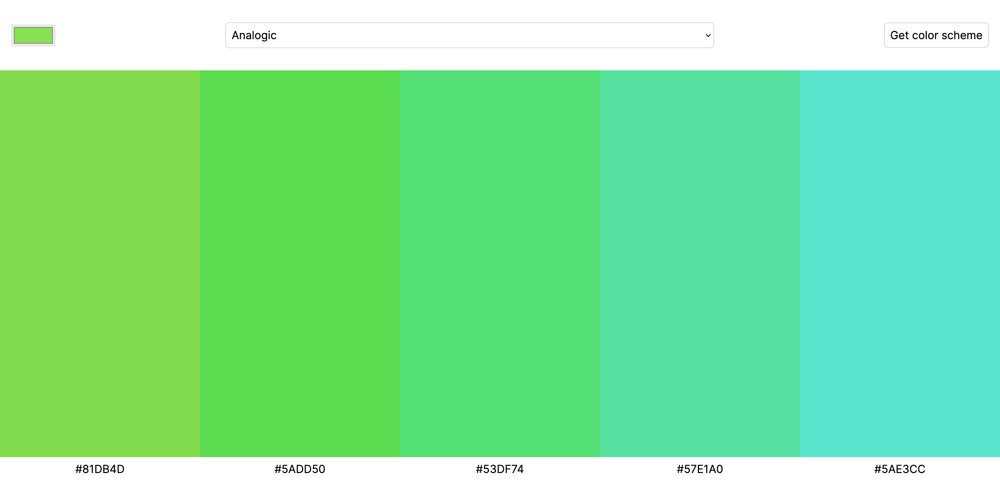

# Scrimba - Color Scheme Generator

## Table of contents

- [Overview](#overview)
  - [Requirements](#requirements)
  - [Screenshots](#screenshots)
  - [Links](#links)
- [My process](#my-process)
- [What I learned](#what-i-learned)
- [Author](#author)

## Overview

A project from Scrimba frontend bootcamp that involved using [The Color API](https://www.thecolorapi.com) to generate color schemes based on a user defined color.

### Requirements

- Have user defined color selector ✅
- Have user defined mode selector ✅
- Clicking button makes request to API to get color scheme ✅
- Display colors and hex values on page in accordance to Figma design ✅

#### Stretch Goal:

- Click to copy to clipboard ✅

#### Above and beyond:

- Randomly generate color on page load ✅
- Randomly generate mode on page load ✅
- Request color scheme based on randomly generated color and mode on page load ✅
- Save last color and mode in memory to prevent spamming API when user doesn't change the color or mode ✅

### Screenshots

### Links

- Live Site URL: [https://almanzarsaul.github.io/Color-Scheme-Generator/](https://almanzarsaul.github.io/Color-Scheme-Generator/)

## My process

Started basic HTML with predefined colors for the columns, worked on the basic CSS before diving into JavaScript to dynamically set the colors based on the API response. User could easily spam "Get color scheme" button, so I implemented a solution that stores the current color/mode to prevent that. Also added extra functionality that randomly generated a color scheme based on randomly generated color/mode on page load. Lastly, I made the color hex copy to clipboard when user clicked on color column. I ran into some issues where the color columns weren't clickable due to setting their z-index to -99, to fix this I instead kept their z-index default and set the header to z-index 99.

## What I learned

- It's preferable to set z-index over other elements rather than make another element a negative z-index. I had an issue where the color columns were not clickable due to giving them a negative z-index. Instead, I set the header the a 99 z-index and it worked just fine.

## Author

- GitHub - [Saul Almanzar](https://github.com/almanzarsaul)
